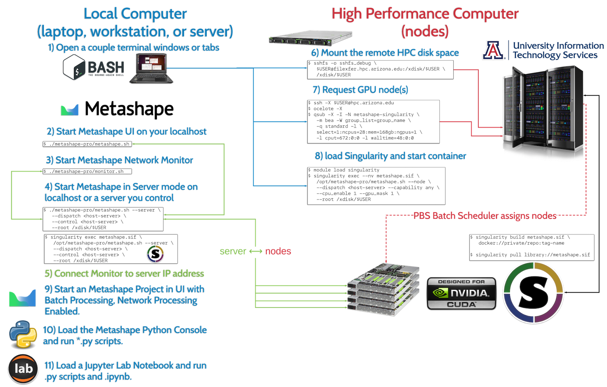

---?image=https://www.greeklegendsandmyths.com/uploads/5/3/1/3/53133595/manuel-samaniego-y-jaramillo-air-juno-orders-aeolus-to-release-the-winds-1800_orig.jpg

@snap[midpoint span-100 text-center text-white text-16 text-bold text-monserrat]
The Airborne Environmental Observations Laboratory for Unoccupied Systems (AEOLUS)
@snapend

@snap[south-west span-100 text-center text-03 text-white]
Image Credit: Manuel de Samaniego (circa 1800) Juno orders Aeolus to release the winds, image in the Public Domain
@snapend

---?color=linear-gradient(80deg, black 10%, gray)

@snap[north span-100 text-08 text-blue font-montserrat]
**Tyson L. Swetnam**
Research Assistant Professor, BIO5 Institute University of Arizona (UA), CyVerse

**Co-Authors**
@snapend

@snap[west span-35 text-08 text-blue font-montserrat]
**David S. LeBauer** 
Director of Data Science, Agricultural Experiment Station UA
@snapend

@snap[south-west span-33]

@snapend

@snap[midpoint span-33 text-08 text-yellow font-montserrat] 
**Jane Wyngaard** 
Systems Engineer, University of Notre Dame - [LANDRS](https://github.com/r4space/LANDRS)
@snapend

@snap[south span-33]  

@snapend

@snap[east span-33 text-08 text-orange font-montserrat]
**David J. Durden** 
Research Scientist Battelle Inc. 
[NEON](https://www.neonscience.org/) 
@snapend

@snap[south-east span-33]

@snapend

---?color=linear-gradient(80deg, black 10%, gray)

@snap[west span-50 text-green font-montserrat]
@css
@ol[text-white]
- into vertical data integration research (i.e. _GxE_ )
- interested in complex data processing pipelines
- prefer a "bespoke solution" to a turn-key one
@olend
@snapend

@snap[east span-50 text-yellow font-montserrat fragment]
@css
@ol[text-orange fragment]
- pretend you just got an important call, get up and leave
- nod thoughtfully (to intimidate others)
- count memes
@olend
@snapend

---?color=linear-gradient(80deg, black 10%, gray)

@snap[north-west span-55 text-yellow font-montserrat]
the Greek name ‘_**Aeolus**_’, means _"**quick-moving, nimble,**"_ 
@snapend

@snap[midpoint span-100 text-yellow font-montserrat]
in mythology he was the _“**Keeper of the Winds, king of the floating island of Aeolia**”_
@snapend

@snap[north-east span-50]

@snapend

@snap[south span-100 text-green fragment font-montserrat]
Our goals are to help manage the **VOLUME VARIETY VELOCITY & VERACITY** of big sUAS data generated by the research community in the cloud-computing realm. 
@snapend

---?color=linear-gradient(80deg, gray 50%, white)

@snap[north font-montserrat span-100 text-black]
Vertical Data Integration Problems

@snap[south-east span-25 font-montserrat text-05 text-white]
credit: R Guralnick, et al. 
@snapend

---?color=linear-gradient(80deg, white 10%, black)
@snap[north span-100 font-montserrat text-black]
Taking science to the edge
@snapend

---?color=linear-gradient(80deg, gray 50%, white)

@snap[north span-100 font-montserrat text-10 text-bold text-yellow]
 
@snapend

@snap[west span-80 fragment]

@snapend

@snap[west span-80 fragment]

@snapend

@snap[east span-33 fragment text-montserrat text-06 text-black]
Extending ecological observations with UAS 
@ul
- supplement the Airborne Observation Platform
- target of opportunity measurement (hot spots & hot moments)
@ulend
@snapend

---?color=linear-gradient(80deg, white 10%, black)

@snap[east span-33 text-white font-montserrat]
@fa[quote-left quote-graphql](Why interoperability and federation?)

@snapend

@snap[north-west span-33]

@snapend

@snap[west span-100]

@snapend

@snap[south-west span-100 text-06 font-montserrat]

@snapend

@snap[south-east span-100 text-06 font-montserrat]
http://www.landrs.org/
@snapend

---?color=linear-gradient(80deg, black 10%, gray)

@snap[north-west span-50]

@snapend

@snap[east span-33 text-white font-montserrat]
@fa[quote-left quote-graphql](Why interoperability and federation?)

@snapend

@snap[south-east span-70 font-montserrat text-06 text-yellow]
**Emergent Challenges for Science sUAS Data Management: Fairness through Community Engagement and Best Practices Development**
Wyngaard et al. Remote Sens. 2019, 11(15), 1797; https://doi.org/10.3390/rs11151797
@snapend

---?color=linear-gradient(80deg, black 10%, gray)

@snap[east span-33 text-white font-montserrat]
@fa[quote-left quote-graphql](Why interoperability and federation?)

@snapend

@snap[north-west span-80]

@snapend

@snap[south-west span-80]

@snapend

@snap[north-east span-33 text-04 font-montserrat]
Time: Sunday 08:25 AM 
Session: Systems Biology and Ontologies
Location: Royal Palm Salon 3-4
Anne Thessen 
@snapend

@snap[south-east span-33 text-06 font-montserrat]
[@img[span-25](https://www.nsf.gov/images/logos/NSF_4-Color_bitmap_Logo.png)](https://www.nsf.gov/) HDR Award 194033
https://genophenoenvo.github.io/
@snapend

---?color=linear-gradient(80deg, black 10%, gray)

@snap[east span-40 text-white font-montserrat]
@fa[quote-left quote-graphql](Why do we need an AEOLUS?)

@snapend

@snap[north-west span-40 fragment text-white fragment text-center font-montserrat]
@box 
<i class="fa fa-ban" aria-hidden="true"> </i>

@snapend

@snap[south-west span-40 fragment text-white font-montserrat text-center]
@box
 ✔
@snapend

@snap[south-east fragment span-40 align-center font-montserrat]

@fa[text-06](oh wait, it's FREE*? )
@snapend

---?color=linear-gradient(80deg, black 10%, gray)
@snap[north span-100 font-montserrat text-yellow text-08]
What I mean by a "bespoke solution" = **Interoperability**

@snapend

---?color=linear-gradient(80deg, white 10%, gray)
@snap[north text-black font-montserrat span-100]
voluntary online survey mid-2019 (n=33)

<canvas data-chart="bar">
<!--
{
 "data": {
  "labels": ["Agriculture", "Archaeology"," Ecology","Engineering","Geosciences", "Survey, Media, Other"],
  "datasets": [
   {
    "data":[6,1,11,1,13,1],
    "label":"community",
    "backgroundColor":"green"
   }
  ]
 },
 "options": { "responsive": "true" }
}
-->
</canvas>
@snapend

---?color=linear-gradient(80deg, white 10%, gray)

@snap[north-west span-66]
<canvas data-chart="radar">
<!--
{
 "data": {
  "labels": ["locally","server","cloud","private", "govt"],
  "datasets": [
   {
    "data":[24,19,14,5,2],
    "label":"Storage",
    "backgroundColor":"rgba(240,160,80,.6)"
   }
  ]
 },
 "options": { "responsive": "true" }
}
-->
</canvas>
@snapend

@snap[north-east span-66]
<canvas data-chart="radar">
<!--
{
 "data": {
  "labels": ["locally","server","cloud","private","hpc"],
  "datasets": [
   {
    "data":[25,13,8,5,11],
    "label":"Processing",
    "backgroundColor":"rgba(240,160,80,.6)"
   }
  ]
 },
 "options": { "responsive": "true" }
}
-->
</canvas>
@snapend

@snap[south span-66]
<canvas data-chart="radar">
<!--
{
 "data": {
  "labels": ["storage","sharing","processing","findability","access"],
  "datasets": [
   {
    "data":[6,8,15,5,10],
    "label":"Major",
    "backgroundColor":"rgba(80,160,240,.6)"
   },
  {
    "data":[12,12,10,10,7],
    "label":"Priority",
    "backgroundColor":"rgba(240,160,80,.6)"
   },
     {
    "data":[10,6,4,10,8],
    "label":"Least Concern",
    "backgroundColor":"red"
   }
  ]
 },
 "options": { "responsive": "true" }
}
-->
</canvas>
@snapend

---?color=linear-gradient(80deg, black 10%, gray)

@snap[north-west span-33]

@snapend

@snap[west span-33 fragment]
@box[bg-green text-white rounded box-padding](Pro # Widely Used, Network & HPC)
@snapend

@snap[south-west span-33 fragment]
@box[bg-orange text-white rounded box-padding](Con # Training, $$$ floating licenses)
@snapend

@snap[north span-33 align-top]

@snapend

@snap[midpoint span-33 fragment]
@box[bg-green text-white rounded box-padding](Pro # Ready to use, ESRI integration)
@snapend

@snap[south span-33 fragment]
@box[bg-orange text-white rounded box-padding](Con # less scalable, $$$ for Cloud)
@snapend

@snap[north-east]

@snapend

@snap[east span-33 fragment]
@box[bg-green text-white rounded box-padding](Pro # Free, nice interface)
@snapend

@snap[south-east span-33 fragment]
@box[bg-orange text-white rounded box-padding](Con # less accurate, less scalable)
@snapend

---?color=linear-gradient(80deg, black 10%, gray)

@snap[west h3-white span-50]
### @fa[twitter] a recent informal survey of community members
@snapend

@snap[east span-50]
  @tweet[https://twitter.com/tommaso_jucker/status/1189847902673342464]
@snapend

---?color=linear-gradient(80deg, black 10%, gray)

@snap[east span-40 text-white]
@fa[quote-left quote-graphql](Why process data on cloud or HPC?)

@snapend

@snap[north-west span-50 fragment text-white font-montserrat]
@box
@snapend

@snap[south-west span-50 fragment text-white font-montserrat]
@box across _X_ (plots, fields, sites))
@snapend

---?color=linear-gradient(80deg, black 10%, gray)

@snap[east span-50 text-white]
@fa[quote-left quote-graphql](Cloud & HPC in three _EASY_ steps)
@snapend

@snap[north-west span-40 fragment text-white font-montserrat]
@box
@snapend

@snap[west span-40 fragment text-white font-montserrat]
@box
@snapend

@snap[south-west span-40 fragment text-white font-montserrat]
@box
@snapend

@snap[north-east fragment span-50]
@fa[text-06 font-montserrat](**Narrator Voice**: It was not "_EASY_ ")

@snapend

---?color=linear-gradient(80deg, white 10%, gray) 

---?color=linear-gradient(80deg, gray 10%, black)

@snap[north-west fragment span-40 font-montserrat text-05]
@css

@snapend

@snap[east fragment span-40 font-montserrat text text-05]
@css

@snapend 

@snap[north-east fragment span-40 font-montserrat text-05]
@css

@snapend

@snap[west fragment span-40 font-montserrat text-05]
@css

@snapend

@snap[north fragment span-40 font-montserrat text-05]
@css

@snapend

@snap[midpoint fragment span-40 font-montserrat text-05]

@css
@snapend

@snap[south span-100 text-08 font-montserrat ]

Explanation via a 1980s cartoon

@snapend

---?image=assets/imagery/agisoft_network.png

---?color=linear-gradient(80deg, white 10%, gray)

@snap[north-west span-50 text-black]
Cost of computing
@snapend

<canvas data-chart="bar">
<!--
{
 "data": {
  "labels": ["Your Laptop", "Workstation", "older HPC","newish HPC", " AWS EC2 g4dn.16xlarge"],
  "datasets": [
   {
    "data":[4,16,28,96,64],
    "label":"CPU Cores",
    "backgroundColor":"green"
   },
   {
    "data":[16,128,168,256,256],
    "label":"CPU RAM (GB)",
    "backgroundColor":"rgba(120,120,220,.8)"
   }
  ]
 },
 "options": { "responsive": "true" }
}
-->
</canvas>

@snap[north-east fragment font-montserrat text-06]
node = $4.35 / hr 
10 nodes = $43.52 / hr 
100 nodes = $435.20 / hr
@snapend

---?color=linear-gradient(80deg, black 10%, gray)

@snap[north span-100 font-montserrat] 
Data Management Lifecycle
@uml
@snapend

@snap[south-west span-33 fragment font-montserrat]
Data Management Plan
@snapend

@snap[west span-33 fragment font-montserrat]
Collection
@snapend

@snap[midpoint snap-33 fragment font-montserrat]
QA/QC
Metadata Indexing
@snapend

@snap[east span-33 fragment font-montserrat]
Analysis
@snapend

@snap[south-east span-33 fragment font-montserrat]
Digital Object Identifier (DOI) & Publication
@snapend

@snap[south span-33 fragment font-montserrat]
Curation 
Re-use
@snapend

---?color=linear-gradient(80deg, black 10%, gray)

@snap[north span-33 font-montserrat]
Survey Says (n=33)
@snapend

@snap[west span-50 font-montserrat text-10]
Do you know where you're going to publish your data?
@snapend

@snap[east span-50 font-montserrat text-10]
Are your data public (yet)?
@snapend

@snap[south-west span-50 text-yellow font-montserrat text-10 text-center fragment]
46% No
53% Yes
@snapend

@snap[south-east span-50 text-yellow text-center font-montserrat text-08 fragment] 
19% Yes 
66% No - but we plan to
13% No - we cannot afford to
3% No - we aren't going to
@snapend

---?color=linear-gradient(80deg, black 10%, gray)

## Publishing your Data

---?image=/assets/imagery/gillan_etal.png

---?color=linear-gradient(80deg, black 10%, gray)

Bring your research to CyVerse

---

Calliope Slides

---?color=linear-gradient(80deg, black 10%, gray)

@snap[east span-40 text-white font-montserrat]
@fa[quote-left quote-graphql](Why use CyVerse or XSEDE?)

@snapend

@snap[north-west span-40 fragment text-white font-montserrat]
@box
@snapend

@snap[south-west span-40 fragment text-white font-montserrat]
@box
@snapend

@snap[south-east fragment span-40]

@fa[text-06 font-montserrat](oh, & it's FREE)
@snapend

---?color=linear-gradient(80deg, gray 10%, black)

@snap[north span-100]

@snapend

@snap[west span-33 text-white]
@box
@ol[text-08]
- Host up to 10TB
- Cloud Storage
- Share with colleagues
@olend
@snapend

@snap[midpoint span-33 text-white]
@box
@ol[text-08]
- RStudio & Jupyter Notebooks
- Share Analyses
- Batch Processing
@olend
@snapend

@snap[east span-33 text-white]
@box
@ol[text-08]
- Virtual Machines
- Run Jobs
- Run Services
@olend
@snapend 

@snap[south span-100]
[Sign up here](https://user.cyverse.org)
@snapend

---?color=linear-gradient(80deg, gray 10%, black)

@snap[north-west span-50]
[@img[span-100](https://www.xsede.org/image/layout_set_logo?img_id=1478827&t=1574800172821)](https://www.xsede.org) 
@snapend

@snap[north-east span-50]
[@img[span-75](https://www.renci.org/wp-content/uploads/2008/10/osg_logo.png)](https://opensciencegrid.org/)
@snapend

@snap[west span-50 text-white]
[@img](https://www.tacc.utexas.edu/use-tacc/getting-started)
[@img](https://www.tacc.utexas.edu/)
@snapend

@snap[east span-50 text-white]
@box
@ol[text-08]
- Run Jobs from CyVerse
@olend
@snapend

@snap[south span-100]
Having trouble getting access?  

Sign up for an [XSEDE Portal Account](https://portal.xsede.org/)
@snapend

---

Acknowledgements

All images shown in this presentation are in the public domain or are property of their credited creators. The web address of each image is visible in the presentation at: https://github.com/tyson-swetnam/2020-01-11-PAG/

---?color=linear-gradient(80deg, black, #567AD2)

CyVerse is funded entirely by the National Science Foundation under Award Numbers [DBI-0735191](https://www.nsf.gov/awardsearch/showAward?AWD_ID=0735191), [DBI-1265383](https://www.nsf.gov/awardsearch/showAward?AWD_ID=1265383), and [DBI-1743442](https://www.nsf.gov/awardsearch/showAward?AWD_ID=1743442&HistoricalAwards=false).

@snap[south span-45]
[@img[span-50](https://phoenixmed.arizona.edu/sites/default/files/campus/marcomm/brand/master-logo/1-ua-vertical/ua_stack_rgb_4.png)](https://www.arizona.edu/)
@snapend

@snap[north span-33]
[@img[span-50](https://www.nsf.gov/images/logos/NSF_4-Color_bitmap_Logo.png)](https://www.nsf.gov/)
@snapend

@snap[south-west span-33]
[@img](https://www.tacc.utexas.edu/)
@snapend

@snap[south-east span-33]
[@img[span-100](https://www.cshl.edu/wp-content/uploads/2018/07/cshl_logo_alternate-RGB_KO.png)](https://www.cshl.edu/)
@snapend

---